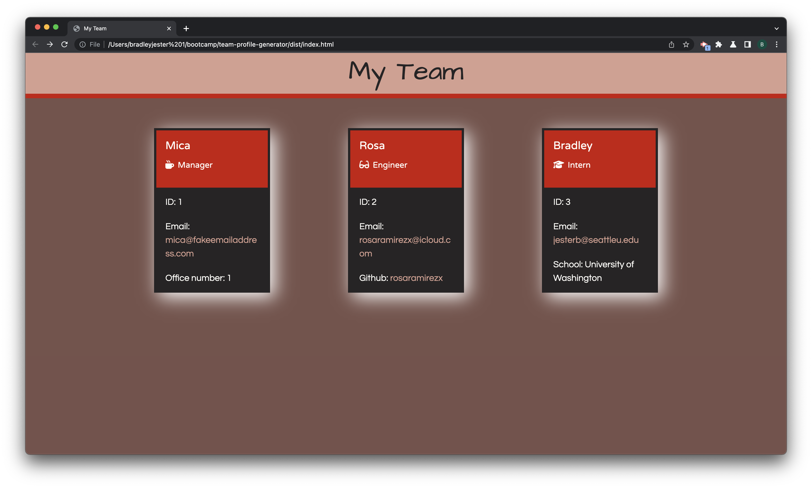
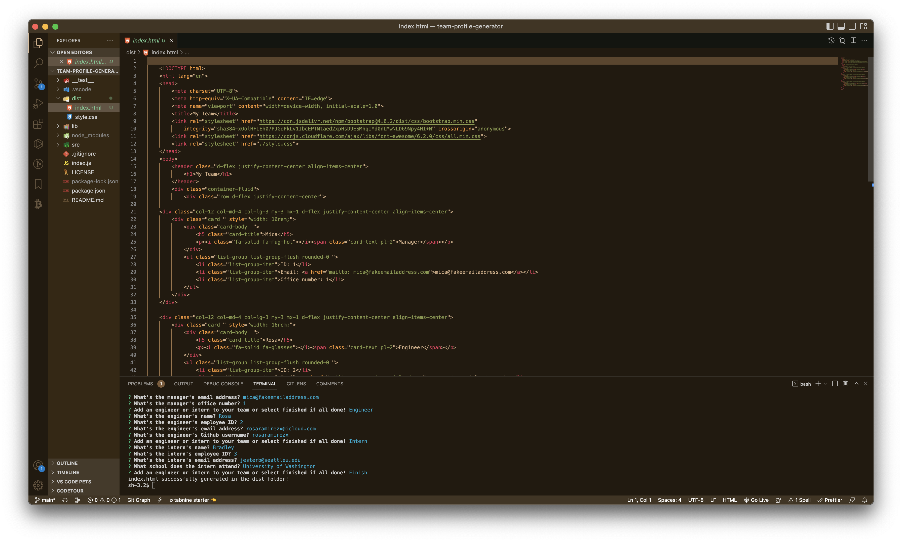

# Team Profile Generator

## License

[This application is under the MIT license](https://opensource.org/licenses/MIT)

## Description

A Node.js command-line application that takes in information about employees on a software engineering team and generates an HTML webpage that displays summaries for each person.

## Table of Contents

- [Team Profile Generator](#team-profile-generator)
  - [License](#license)
  - [Description](#description)
  - [Table of Contents](#table-of-contents)
  - [Installation](#installation)
  - [Usage](#usage)
    - [Sample index.html File](#sample-indexhtml-file)
    - [Command-Line Prompts](#command-line-prompts)
    - [Video](#video)
  - [Contributing](#contributing)
  - [Tests](#tests)
  - [Questions](#questions)
    - [GitHub](#github)
    - [Email](#email)

## Installation

1. Navigate in your Terminal to where you want the repository to lie and run `git clone https://github.com/jesterb0206/team-profile-generator.git`.
2. In order to download the packages and dependencies `cd` into the `team-profile-generator` folder and run `npm install`.

## Usage

1. In the command-line terminal, navigate to the `team-profile-generator` folder if you're not there already. Then run `node index.js`. You'll be asked to enter the manager's name, employee ID, email address and office number.
2. Next, you'll be asked if you want to add an "engineer" or "intern" to your team. If so, answer the following prompted questions.
3. When you're all done select "finished." An `index.html` file will be created in the `dist` folder.

### Sample index.html File

### Command-Line Prompts

### Video

Click on the video link below to learn how to use the Team Profile Generator command-line application:

[Team Profile Generator Walkthrough Video](assets/video/team-profile-generator-walkthrough-video.webm)

## Contributing

Without the following sources my Team Profile Generator wouldn't be complete:

-  Bootstrap v4.6.2

-  </a> Jest v29.2.2

- https://fontawesome.com/docs Font Awesome v6.2.0

- https://www.npmjs.com/package/inquirer/v/8.2.4 Inquirer v8.2.4

- https://colorleap.app/time/1960 I used a color palette called "The Brain" from Color Leap's website for my CSS styling.

- https://fonts.google.com I imported Architects Daughter, Questrial and Varela Round from Google Fonts for my CSS styling as well.

## Tests

Testing is key to making code maintainable, so for this Node.js command-line application I wrote unit tests for each part of my code and ensured that it passed all of them. The unit tests were written using the JavaScript framework Jest, and they can be found in the "**test**" folder of my repository.

## Questions

If you have any additional questions, you can reach me at:

### GitHub

[jesterb0206](https://www.github.com/jesterb0206)

### Email

jesterb@seattleu.edu
